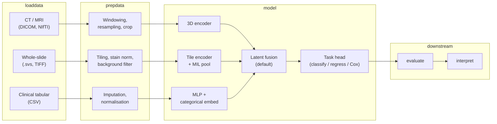

# kalecancer architecture

The design of the `kalecancer` package and the reasoning behind it. Much of this
document was written before implementation and remains in future tense; the table
below records what is now built. Items marked **Open question** are unresolved.

| Area | State |
| --- | --- |
| WSI loading, cohort matching, patient-level splitting | Implemented |
| Attention MIL encoder | Implemented |
| Cox head, loss, and survival metrics | Implemented, using TorchSurv |
| Attention interpretation | Implemented |
| Multimodal fusion (early, late, hybrid) | Implemented as model APIs; no multimodal cohort loader yet |
| CT/MRI and tabular encoders, `prepdata` transforms, `auto` classes | Planned |

For usage rather than rationale, see the [quickstart](quickstart.md), the
[WSI pipeline reference](../examples/wsi_survival/) and the
[fusion reference](multimodal_fusion.md).

---

## Scope

The initial clinical focus will be **head and neck cancer (HNC)**.

The intended use case is **treatment decision support**, not diagnosis. Models will aim to inform clinicians about expected outcomes and relative risk under different treatment contexts — not to replace histopathological or radiological diagnosis.

Planned outcome targets:

| Outcome | Definition | Priority |
| --- | --- | --- |
| **Overall survival (OS)** | Death from any cause | **v1 primary target** — death is unambiguous and better recorded than recurrence |
| **Disease-free survival (DFS)** | Recurrence or progression | v1 secondary / v2 competing-risk target |
| **Treatment response** | Short-term response to therapy | Planned; exact definition TBD with clinical partners |

**Overall survival** will be the first modelling target because event ascertainment is clearer and more consistently recorded across sites than recurrence.

---

## Pipeline

The package will follow PyKale’s verb-oriented pipeline, extended with a dedicated **`survival`** stage for time-to-event tasks.

Each stage will expose a stable data contract so components can be built and tested independently before real cohort data arrives.

---

## Modality handling

CT/MRI and WSI differ **in kind**, not just in file format:

- **CT/MRI** is a **3D radiology volume** with genuine depth between slices. Preprocessing must respect voxel spacing, orientation, and volumetric continuity (resampling, windowing, field-of-view cropping).
- **WSI** is **flat 2D but gigapixel-scale**. Preprocessing must handle tile boundaries, background filtering, stain variation, and stitching logic at inference — not volumetric resampling.

| Modality | Format | Dimensionality | Preprocessing (planned) | Planned v1 encoder |
| --- | --- | --- | --- | --- |
| **CT / MRI** | DICOM, NIfTI | 3D volume | Hounsfield windowing, isotropic resampling, ROI crop | MONAI 3D encoder — UNETR or SwinUNETR trunk, or 3D ResNet feature extractor |
| **WSI** | `.svs`, TIFF | Gigapixel 2D (processed as tile bag) | Fixed-size tiling, stain normalisation (e.g. Macenko/Vahadane), background filtering | Tile-level CNN/ViT encoder with **MIL aggregation**; will use MONAI `WSIReader` and `PatchWSIDataset` |
| **Tabular** | CSV | ~50 features, missing values | Imputation, scaling, categorical encoding | MLP with **categorical embeddings** for nominal fields |

Loaders in `kalecancer.loaddata` will normalise each modality into a typed record (tensor + metadata + modality mask). Transforms in `kalecancer.prepdata` will be composable and config-driven.

---

## Fusion

Because input shapes are **incommensurable** — a 3D volume, a variable-size tile bag, and a ~50-dimensional vector — fusion at the raw input level is not viable. Each modality is encoded to a fixed-dimensional latent vector first, and fusion operates in that shared latent space.

Three strategies are implemented, distinguished by what they combine: **features** (early), **decisions** (late), or both (hybrid). The fusion operator is config-swappable, so the same encoders and task head work with any of them. They build on `kale.embed.multimodal_fusion`, and `ProductOfExperts` is the preferred route when modalities can be missing, because absent experts drop out of the product without retraining a model per combination.

Missing modalities are a **first-class requirement**, not an edge case: real cohorts rarely have every modality for every patient. A per-sample modality mask is carried from `loaddata` through to the model, absent modalities are represented by learned placeholders rather than zero-padding, and modality dropout during training builds robustness. This supports the clinically required combinations — imaging plus clinical, pathology plus clinical, and a clinical-only baseline.

See [multimodal_fusion.md](multimodal_fusion.md) for the API, the fusion operators, and the per-mechanism behaviour under missing modalities.

`BANLayer` in `kale.embed.attention` remains a candidate for cross-modal attention between latent representations.

---

## Time-to-event

Survival outcomes require dedicated handling. Many patients will be **censored** — followed until study end or loss to follow-up without the event occurring. Treating time-to-event as plain regression on observed times ignores censoring and will bias estimates.

### v1: Cox proportional hazards

The v1 task head will emit a **risk score** via a Cox partial likelihood loss. The model will learn a linear combination of fused latent features that ranks patients by hazard without specifying a full survival curve parametrically.

### v2: Competing risks

Overall survival and disease-free survival **compete** — a patient who dies cannot subsequently recur. v2 will add **discrete-time / DeepHit-style** heads for competing risks, allowing separate hazard estimates per event type.

### Label contract

Survival labels follow a fixed contract: `time` is the time from baseline to event or censoring in a config-defined unit, and `event` is `1` when observed and `0` when censored. Competing-risk models will add an optional `event_type` naming the event category.

Metrics and their leakage rules are documented in the [WSI pipeline reference](../examples/wsi_survival/).

### Reference implementation: TorchSurv

We will use **TorchSurv** as the reference implementation for survival losses and metrics. It was chosen because its losses and metrics are **standalone** and work with custom PyTorch networks — no requirement to adopt a monolithic survival library or a fixed model zoo.

### Core boundary: `kalecancer/survival/`

Survival code will live in **`kalecancer/survival/`** under strict isolation rules:

- **Cancer-agnostic** — may import only `torch`, `numpy`, and `pykale`; must not import from other `kalecancer` modules.
- **Own test suite** — unit tests against synthetic tensors (no real patient data required).
- **CI enforcement** — `tests/test_survival_boundary.py` will parse every file under `survival/` and fail on forbidden imports.

This module is intended to **move into PyKale core** once stable, because **`kale-cardiac`** and other domain packages will need the same time-to-event capability without duplicating Cox heads, losses, and metrics.

---

## Interpretability

Interpretability will be built into the pipeline as a post-prediction stage (`kalecancer.interpret`), not bolted on after deployment.

| Modality | Planned method | Output |
| --- | --- | --- |
| **Tabular** | SHAP (TreeExplainer or KernelExplainer on MLP) | Per-feature importance for clinical variables |
| **CT / MRI** | Grad-CAM via Captum | Spatial attribution on 3D volumes (projected to slices for display) |
| **WSI** | Grad-CAM on tile encoder + MIL aggregation | Tile-level heatmaps stitched to slide coordinates |
| **Modality-level** | **v1:** ablation — zero out a modality at inference and measure change in predicted risk | Relative contribution of CT vs WSI vs tabular |
| **Modality-level** | **v2:** hybrid fusion auxiliary heads or ProductOfExperts variance | Learned per-modality contribution without full forward-pass ablation |

### Caveat: Grad-CAM on Cox models

Grad-CAM on a **Cox risk score** attributes regions that drive **higher predicted hazard**, not a class logit. Heatmaps will mean *"regions associated with higher predicted risk"* rather than *"regions predicting death with probability p"*. This distinction will be documented in user-facing outputs and example notebooks so clinical collaborators interpret attributions correctly.

The `interpret` optional dependency group (`shap`, `captum`) will keep heavy explanation libraries out of the core install.

---

## Development strategy

Components will be built and tested against **synthetic data first**. This defines the data contract explicitly — tensor shapes, label fields, modality masks, censoring patterns — before real clinical data arrives.

| Phase | Data source | Goal |
| --- | --- | --- |
| **1. Synthetic** | Generated tensors and CSV in `tests/` and `examples/` | Validate loaders, transforms, encoders, fusion, Cox head, and metrics in isolation |
| **2. Public** | Public oncology datasets (once confirmed — see open questions) | End-to-end pipeline on real formats with known outcomes |
| **3. Private NHS** | Site-specific cohort (future) | Any private pipeline will be **validated on synthetic data first** before it touches real patient records |

Public data will come first. Private NHS integration will reuse the same contracts proven on synthetic and public data, with additional governance and access controls outside this package.

Auto-configuration classes (`kalecancer.auto.AutoCancer*`) will be added once individual stages stabilise, providing a single entry point for clinical collaborators who prefer config files over composing pipelines manually.

---

## Resolved questions

| Question | Resolution |
| --- | --- |
| **Which public dataset** to validate against | **HANCOCK** (763 head and neck patients, CC BY 4.0). Pre-extracted UNI encodings are part of the release and are streamed directly from the published archives. |
| **Where `embed` and `predict` live** | Kept merged under `model/`, with a separate `pipeline/` for trainers and runners, mirroring `kale.pipeline`. |
| **Survival library** | TorchSurv, as planned. `LowRankTensorFusion` is the one PyKale component reimplemented rather than reused, because its parameters are not registered with the module. |

## Open questions

| # | Question | Impact |
| --- | --- | --- |
| 1 | **Exact tabular schema** and missingness rate for the tabular branch | Affects imputation strategy and model capacity |
| 2 | **FT-Transformer vs MLP** for tabular encoding — depends on sample size | At a few hundred patients an MLP with embeddings is likely sufficient |
| 3 | **How patients are matched across modalities** when a multimodal cohort loader is added | Determines whether the fusion APIs need a modality-mask loader or a joined cohort record |

---

## Related documents

- [Quickstart](quickstart.md) — running the pipeline
- [WSI survival pipeline](../examples/wsi_survival/) — inputs, configuration, outputs
- [Multimodal fusion](multimodal_fusion.md) — fusion APIs
- [AGENTS.md](../AGENTS.md) — conventions and constraints for contributors
- `tests/test_survival_boundary.py` — CI enforcement of the `survival/` isolation rule
- PyKale fusion modules — [`kale.embed.multimodal_fusion`](https://pykale.readthedocs.io/en/latest/kale.embed.html)
