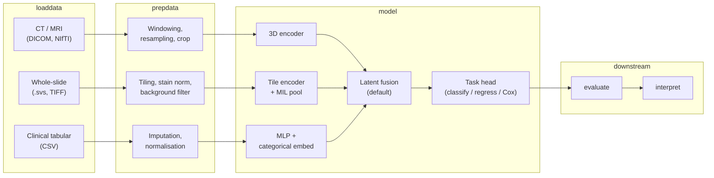

# kalecancer architecture (planning)

This document describes the **intended** design of the `kalecancer` package. It is written in future tense and reflects decisions made so far, not implemented functionality. Items marked **Open question** are unresolved.

---

## Scope

The initial clinical focus will be **head and neck cancer (HNC)**.

The intended use case is **treatment decision support**, not diagnosis. Models will aim to inform clinicians about expected outcomes and relative risk under different treatment contexts — not to replace histopathological or radiological diagnosis.

Planned outcome targets:

| Outcome | Definition | Priority |
| --- | --- | --- |
| **Overall survival (OS)** | Death from any cause | **v1 primary target** — death is unambiguous and better recorded than recurrence |
| **Disease-free survival (DFS)** | Recurrence or progression | v1 secondary / v2 competing-risk target |
| **Treatment response** | Short-term response to therapy | Planned; exact definition TBD with clinical partners |

**Overall survival** will be the first modelling target because event ascertainment is clearer and more consistently recorded across sites than recurrence.

---

## Pipeline

The package will follow PyKale’s verb-oriented pipeline, extended with a dedicated **`survival`** stage for time-to-event tasks.

Each stage will expose a stable data contract so components can be built and tested independently before real cohort data arrives.

---

## Modality handling

CT/MRI and WSI differ **in kind**, not just in file format:

- **CT/MRI** is a **3D radiology volume** with genuine depth between slices. Preprocessing must respect voxel spacing, orientation, and volumetric continuity (resampling, windowing, field-of-view cropping).
- **WSI** is **flat 2D but gigapixel-scale**. Preprocessing must handle tile boundaries, background filtering, stain variation, and stitching logic at inference — not volumetric resampling.

| Modality | Format | Dimensionality | Preprocessing (planned) | Planned v1 encoder |
| --- | --- | --- | --- | --- |
| **CT / MRI** | DICOM, NIfTI | 3D volume | Hounsfield windowing, isotropic resampling, ROI crop | MONAI 3D encoder — UNETR or SwinUNETR trunk, or 3D ResNet feature extractor |
| **WSI** | `.svs`, TIFF | Gigapixel 2D (processed as tile bag) | Fixed-size tiling, stain normalisation (e.g. Macenko/Vahadane), background filtering | Tile-level CNN/ViT encoder with **MIL aggregation**; will use MONAI `WSIReader` and `PatchWSIDataset` |
| **Tabular** | CSV | ~50 features, missing values | Imputation, scaling, categorical encoding | MLP with **categorical embeddings** for nominal fields |

Loaders in `kalecancer.loaddata` will normalise each modality into a typed record (tensor + metadata + modality mask). Transforms in `kalecancer.prepdata` will be composable and config-driven.

---

## Fusion

Because input shapes are **incommensurable** — a 3D volume, a variable-size tile bag, and a ~50-dimensional vector — **early fusion at the input level will not be the default**. Each modality will be encoded to a fixed-dimensional latent vector first; fusion will operate in that shared latent space.

### Strategy verdicts

| Strategy | Verdict | Rationale |
| --- | --- | --- |
| **Early fusion** | Narrow use only | Viable only when modalities share geometry (e.g. registered PET + CT in the same voxel grid). Not suitable for CT + WSI + tabular. |
| **Late fusion** | Baseline to beat | Independent per-modality heads, fuse predictions. Simple, interpretable, but ignores cross-modal interactions during representation learning. |
| **Intermediate (latent) fusion** | **Default for v1** | Encoders produce latent vectors; a fusion module combines them before the task head. Handles incommensurable inputs naturally. |
| **Hybrid fusion** | **v2** | Intermediate trunk with **auxiliary per-modality heads** — supports both joint prediction and modality-specific supervision / interpretability. |

### Planned PyKale building blocks

We will **build on existing PyKale components** rather than reimplement fusion from scratch:

| Component | Location | Intended use |
| --- | --- | --- |
| `Concat` | `kale.embed.multimodal_fusion` | Simple latent concatenation baseline |
| `LowRankTensorFusion` | `kale.embed.multimodal_fusion` | Tensor-based multimodal interaction |
| `BimodalInteractionFusion` | `kale.embed.multimodal_fusion` | Two-modality interaction only (e.g. CT + tabular ablation) |
| `ProductOfExperts` | `kale.embed.multimodal_fusion` | **Intended route for missing modalities** — combines Gaussian experts in closed form and degrades gracefully when one expert is absent |
| `BANLayer` | `kale.embed.attention` | Candidate for **cross-modal attention** between latent representations |

**ProductOfExperts** is the preferred fusion path when modalities may be missing at inference time, because absent experts can be omitted without retraining a separate model per combination.

Fusion strategy will be **config-swappable** (YAML / dataclass config): the same encoders and task head will plug into `Concat`, `LowRankTensorFusion`, `ProductOfExperts`, or other registered fusion modules without code changes.

---

## Missing modalities

Missing modalities will be a **first-class design requirement**, not an edge case. Real HNC cohorts will rarely have CT, WSI, and full tabular data for every patient.

Planned mechanisms:

1. **Per-sample modality mask** — a boolean vector indicating which modalities are present, carried through the pipeline from `loaddata` to `model`.
2. **Learned "missing" embeddings** — on non-PoE fusion paths, absent modalities will be represented by a learned placeholder embedding rather than zero-padding.
3. **Modality dropout during training** — random modality dropout will simulate missing-data patterns and improve robustness at inference.

This design will directly support clinically required flexible combinations:

- imaging + tabular (CT + clinical)
- pathology + tabular (WSI + clinical)
- tabular-only baseline (clinical features alone)

**ProductOfExperts** fusion will be the primary path for graceful missing-modality handling; other fusion modules will use the mask + missing-embedding pattern.

---

## Time-to-event

Survival outcomes require dedicated handling. Many patients will be **censored** — followed until study end or loss to follow-up without the event occurring. Treating time-to-event as plain regression on observed times ignores censoring and will bias estimates.

### v1: Cox proportional hazards

The v1 task head will emit a **risk score** via a Cox partial likelihood loss. The model will learn a linear combination of fused latent features that ranks patients by hazard without specifying a full survival curve parametrically.

### v2: Competing risks

Overall survival and disease-free survival **compete** — a patient who dies cannot subsequently recur. v2 will add **discrete-time / DeepHit-style** heads for competing risks, allowing separate hazard estimates per event type.

### Label contract

From the start, survival labels will follow a fixed contract:

| Field | Type | Meaning |
| --- | --- | --- |
| `time` | float | Time from baseline to event or censoring (days or months, config-defined) |
| `event` | bool / int | `1` if event observed, `0` if censored |
| `event_type` | int (optional) | Event category for competing-risk models (e.g. death vs recurrence) |

### Metrics

| Metric | Purpose |
| --- | --- |
| **Harrell's C-index** | Concordance — does the model rank patients who event earlier higher? |
| **Time-dependent AUC** | Discrimination at specific time horizons |
| **Integrated Brier score** | Calibration over the follow-up period |

### Reference implementation: TorchSurv

We will use **TorchSurv** as the reference implementation for survival losses and metrics. It was chosen because its losses and metrics are **standalone** and work with custom PyTorch networks — no requirement to adopt a monolithic survival library or a fixed model zoo.

### Core boundary: `kalecancer/survival/`

Survival code will live in **`kalecancer/survival/`** under strict isolation rules:

- **Cancer-agnostic** — may import only `torch`, `numpy`, and `pykale`; must not import from other `kalecancer` modules.
- **Own test suite** — unit tests against synthetic tensors (no real patient data required).
- **CI enforcement** — `tests/test_survival_boundary.py` will parse every file under `survival/` and fail on forbidden imports.

This module is intended to **move into PyKale core** once stable, because **`kale-cardiac`** and other domain packages will need the same time-to-event capability without duplicating Cox heads, losses, and metrics.

---

## Interpretability

Interpretability will be built into the pipeline as a post-prediction stage (`kalecancer.interpret`), not bolted on after deployment.

| Modality | Planned method | Output |
| --- | --- | --- |
| **Tabular** | SHAP (TreeExplainer or KernelExplainer on MLP) | Per-feature importance for clinical variables |
| **CT / MRI** | Grad-CAM via Captum | Spatial attribution on 3D volumes (projected to slices for display) |
| **WSI** | Grad-CAM on tile encoder + MIL aggregation | Tile-level heatmaps stitched to slide coordinates |
| **Modality-level** | **v1:** ablation — zero out a modality at inference and measure change in predicted risk | Relative contribution of CT vs WSI vs tabular |
| **Modality-level** | **v2:** hybrid fusion auxiliary heads or ProductOfExperts variance | Learned per-modality contribution without full forward-pass ablation |

### Caveat: Grad-CAM on Cox models

Grad-CAM on a **Cox risk score** attributes regions that drive **higher predicted hazard**, not a class logit. Heatmaps will mean *"regions associated with higher predicted risk"* rather than *"regions predicting death with probability p"*. This distinction will be documented in user-facing outputs and example notebooks so clinical collaborators interpret attributions correctly.

The `interpret` optional dependency group (`shap`, `captum`) will keep heavy explanation libraries out of the core install.

---

## Development strategy

Components will be built and tested against **synthetic data first**. This defines the data contract explicitly — tensor shapes, label fields, modality masks, censoring patterns — before real clinical data arrives.

| Phase | Data source | Goal |
| --- | --- | --- |
| **1. Synthetic** | Generated tensors and CSV in `tests/` and `examples/` | Validate loaders, transforms, encoders, fusion, Cox head, and metrics in isolation |
| **2. Public** | Public oncology datasets (once confirmed — see open questions) | End-to-end pipeline on real formats with known outcomes |
| **3. Private NHS** | Site-specific cohort (future) | Any private pipeline will be **validated on synthetic data first** before it touches real patient records |

Public data will come first. Private NHS integration will reuse the same contracts proven on synthetic and public data, with additional governance and access controls outside this package.

Auto-configuration classes (`kalecancer.auto.AutoCancer*`) will be added once individual stages stabilise, providing a single entry point for clinical collaborators who prefer config files over composing pipelines manually.

---

## Open questions

The following items are **unresolved** and may change the architecture above.

| # | Question | Impact |
| --- | --- | --- |
| 1 | **Public dataset not yet confirmed** by clinical partners | Blocks end-to-end public-data validation; synthetic-first strategy mitigates this for now |
| 2 | **Exact tabular schema**, missingness rate, and **cohort size** unknown | Affects imputation strategy, model capacity, and whether advanced tabular architectures are justified |
| 3 | **FT-Transformer vs MLP** for tabular encoding — depends on sample size | If N is small (~hundreds), a simple MLP with embeddings is likely sufficient; FT-Transformer may not be warranted |
| 4 | **Whether `embed` and `predict` should stay merged in `model/` or split** into separate subpackages | Affects package layout and PyKale alignment; current skeleton merges them under `model/` for simplicity |

---

## Related documents

- [README](../README.md) — installation, package overview, and current status
- `tests/test_survival_boundary.py` — CI enforcement of the `survival/` isolation rule
- PyKale fusion modules — [`kale.embed.multimodal_fusion`](https://pykale.readthedocs.io/en/latest/kale.embed.html)
