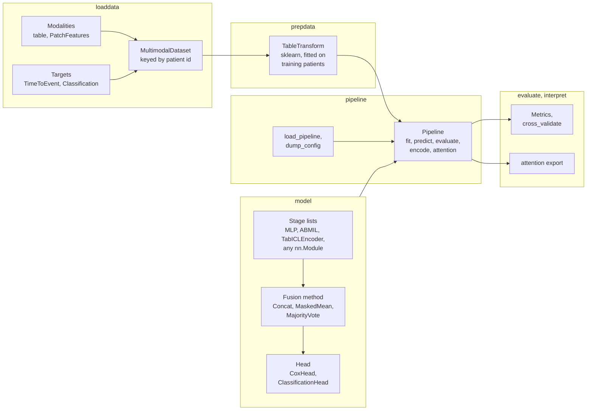

# kalecancer architecture

## Scope

The library supplies mechanisms only. Nothing in `kalecancer/` names a dataset, an endpoint column, a file pattern or
a published split.

---

## Design in one paragraph

There is **one estimator**, `Pipeline`. It takes a model, transforms for each modality and training settings, and it
behaves the same for every model and target.

---

## Package layout

```mermaid
flowchart LR
    subgraph loaddata["loaddata"]
        MOD["Modalities\ntable, PatchFeatures"]
        TGT["Targets\nTimeToEvent, Classification"]
        DS["MultimodalDataset\nkeyed by patient id"]
        MOD --> DS
        TGT --> DS
    end

    subgraph prepdata["prepdata"]
        TT["TableTransform\nsklearn, fitted on\ntraining patients"]
    end

    subgraph model["model"]
        STG["Stage lists\nMLP, ABMIL, TabICLEncoder,\nany nn.Module"]
        FUS["Fusion method\nConcat, MaskedMean,\nMajorityVote"]
        HEAD["Head\nCoxHead,\nClassificationHead"]
        STG --> FUS --> HEAD
    end

    subgraph pipeline["pipeline"]
        PIPE["Pipeline\nfit, predict, evaluate,\nencode, attention"]
        CFG["load_pipeline,\ndump_config"]
    end

    subgraph downstream["evaluate, interpret"]
        MET["Metrics,\ncross_validate"]
        ATT["attention export"]
    end

    DS --> TT --> PIPE
    model --> PIPE
    CFG --> PIPE
    PIPE --> MET
    PIPE --> ATT
```

| Subpackage | Contents |
| --- | --- |
| `loaddata` | `MultimodalDataset`, `train_test_split`, the `Modality` protocol, `PatchFeatures`, `BaseTarget` and the `TimeToEvent` and `Classification` targets |
| `prepdata` | `TableTransform` and `ColumnGroup`: sklearn transforms for table modalities |
| `model` | Encoders (`MLP`, `ABMIL`, `TabICLEncoder`), `InContextModule`, fusion methods, heads, and the four models |
| `pipeline` | `Pipeline`, `EarlyStopping`, Lightning training, `load_pipeline` and `dump_config` |
| `evaluate` | `HarrellC`, `UnoC`, `TimeDependentAUC`, `AUROC`, `BalancedAccuracy`, `cross_validate` |
| `interpret` | `attention` |

Users import from `kalecancer.<stage>`.

---

## Data

### Patients are the identifier

`MultimodalDataset` joins modalities and a target by **patient id**. Ids are strings, unique within each source, and checked across sources for ids that differ only by leading zeros. Splitting is always by patient, never by slide or patch: `subset` and `train_test_split` take patient ids.

### Modalities

A modality is anything with `ids`, `load(id)` and `collate(items)`. A DataFrame indexed by id is wrapped as a table
modality automatically.

| Modality | Value per patient | Collated as |
| --- | --- | --- |
| Table (DataFrame) | one float32 vector | stacked tensor `(n, d)` |
| `PatchFeatures` | `(N_i, D)` matrix of pre-extracted patch features, read lazily from HDF5 | list of tensors, since `N_i` varies |

A whole slide is therefore a bag of pre-extracted patch features, an ordinary modality whose collated value is a list
rather than a stacked tensor. `PatchFeatures` also exposes `coords` for attention export. Feature extraction from raw
slides is out of scope: it happens before the library.

Raw imaging (CT, MRI) would differ in kind: a 3D volume with voxel spacing and orientation to respect, where a
slide is flat but gigapixel-scale. Either would be one new `Modality` class, plus stages to encode it. Neither exists
yet.

### Targets

| Target | Contents | Head |
| --- | --- | --- |
| `TimeToEvent(time, event)` | `time` finite and > 0; `event` is a `bool`, `True` observed, `False` censored | `CoxHead` |
| `Classification(labels, classes)` | labels drawn from an explicit, ordered class list | `ClassificationHead` |

A missing `event` raises an error: an unknown outcome is not a censored one. Each target reports strata (events or
labels), which drive stratified splitting.

Both subclass `BaseTarget`, and so does a new endpoint. A target implements `tensors` (the values the head's loss
reads), `strata` (one discrete label per patient for stratified splitters) and `counts` (the summary counts in fit
reports and cross-validation folds). The fitted pipeline keeps the target itself, so a head can read what it needs from
it, such as the class order of a `Classification`.

### Preparing tables

`TableTransform` is a `ColumnTransformer` whose steps are typed, so a YAML config validates nested steps. Every input
column must be in exactly one `ColumnGroup` or in `drop`, so a column can never be silently dropped or left
untransformed. Transforms are **fitted on the training patients only**, inside `Pipeline.fit`, and only on the
patients who have that modality.

---

## Models

A model is built from a list of stages per modality, a fusion method, and a head.

| Model | Structure |
| --- | --- |
| `Unimodal` | one modality's stages, then a head |
| `EarlyFusion` | fuse the raw vector modalities, then one stage list, then a head |
| `IntermediateFusion` | stages per modality, then a fusion method, then a head |
| `LateFusion` | branch models (each `Unimodal`, `EarlyFusion` or `IntermediateFusion`) trained jointly, then a fusion method |

Inputs from different modalities are incommensurable in shape, so raw inputs are never fused except when they are
already vectors (early fusion). Intermediate fusion first encodes each modality to a vector.

### Stages

A stage list is a `nn.ModuleList` applied in order and must end in `(n, d)` vectors. Stages declare widths as
`in_dim`/`out_dim` (or `in_features`/`out_features`), which the model checks at construction, so a mismatched width
fails before training. Stages available so far:

- `MLP`: linear, ReLU and dropout blocks;
- `ABMIL`: gated attention-based multiple-instance pooling over a bag of patch features, with an `attention()` method;
- `TabICLEncoder`: a pretrained TabICL row encoder (optional `tabular` extra), pinned to an exact version because it
  relies on private internals;
- any `nn.Module`, such as `torch.nn.Linear`.

`InContextModule` covers stages conditioned on labelled training rows, as TabICL is. It may only be the first stage and
is fitted on the training rows before training starts. To keep labels from leaking, a training row is embedded against
the context minus its own stratified fold rather than against itself.

### Fusion

| Method | Stages | Combines | Handles missing modalities |
| --- | --- | --- | --- |
| `Concat` | early, intermediate | vectors, concatenated | No: every patient must have every modality |
| `MaskedMean` | early, intermediate, late | equal-width vectors averaged over those present; in late fusion, branch head outputs (logits or log-hazards) | Yes; in Cox late fusion, only when every patient has every branch |
| `MajorityVote` | late | branch class votes, ties broken by mean probability | Yes |

Every method is a `FusionMethod`. It declares the stages it supports, says through `defined` which patients it can
combine, and owns the rules for when it can be used in `check`. A model describes the experiment in a
`FusionContext` (the stage, which patients have which inputs and which must be combined, the input widths and, in late
fusion, the target type each branch head predicts) and calls `check` once when it is built and again in
`model.check(data)`. Models never test for a particular method, and they use the same `defined` in the forward pass,
so the check and training cannot disagree. In late fusion, `MaskedMean` refuses Cox branches over patients with
different branch subsets because each branch's log-hazard has an arbitrary offset, so averaging different subsets
would reorder patients.

### Missing modalities

Real cohorts rarely have every modality for every patient, so absence is handled in the execution rule shared by all
models rather than as an edge case:

1. Stages run **only on patients who have the modality**.
2. Their outputs are scattered back into the batch with NaN for the others.
3. Fusion **selects** the defined rows. It never multiplies by a mask, because `NaN * 0` is `NaN` and would poison
   gradients.
4. Heads run on defined rows only, and patients without a prediction get NaN.

Absent modalities are therefore not zero-padded or imputed with placeholders: they are absent. Whether a combination
is valid is settled up front by `model.check(data)`, which raises if the fusion method cannot handle the missing
patterns in the data.

### Heads

A head owns everything endpoint-specific: its output, the prediction, the loss, the target check, and the names of the
prediction columns. It declares the target class it predicts as `target_type`; `check_target` accepts that class or a
subclass of it, and `columns` reads the target, for example the class order of a `Classification`.

- **`CoxHead`** outputs a `log_hazard` (higher means higher risk) and trains with the Cox partial likelihood from
  TorchSurv, using Efron or Breslow ties. It has no bias because the partial likelihood is invariant to an additive
  constant. The risk set is the batch, so a batch with no event that has anyone else at risk carries no signal and its
  `loss` returns `None`; the pipeline skips such batches and reports them.
- **`ClassificationHead`** outputs logits, predicts softmax probabilities and trains with cross-entropy.

Censoring is why survival cannot be treated as regression on observed times: many patients are followed until the
study ends or they are lost, and ignoring that biases estimates. Cox ranks patients by hazard without specifying a full
survival curve.

---

## Pipeline

`Pipeline` is a scikit-learn `BaseEstimator` over a `MultimodalDataset`. Its constructor takes the model, transforms,
optimizer, batch size, epochs, an optional validation splitter and early stopping, accelerator, precision and random
state. Training runs on Lightning.

`fit`:

1. validates arguments against the data and model;
2. carves validation patients out of the training patients, stratified by the target;
3. fits the transforms on training patients;
4. deep-copies the model, re-initialises its parameters when `random_state` is set, and fits any `InContextModule`;
5. trains with Lightning, optionally early-stopping on a validation metric and restoring the best weights.

It produces `model_`, `transforms_`, `train_ids_`, `val_ids_`, `target_`, `train_target_`, `history_` and
`fit_report_`. The remaining methods are `predict` (a frame indexed by patient id, with a `branch` option for late
fusion), `evaluate`, `encode` and `attention`.

### Leakage guards

The pipeline is built so a leak fails loudly rather than quietly inflating a score:

- `fit` trains a **copy** and leaves `model` unchanged, and a model that already carries fitted weights is rejected, so
  no cross-validation fold can start from weights trained on other patients.
- Transforms, the validation carve and in-context fitting all use training patients only.
- `evaluate` rejects patients used in `fit` (training or validation) unless `allow_seen=True`.
- Metrics that need a censoring distribution (Uno's C, time-dependent AUC) estimate it from the training target only.
- `cross_validate` checks after every fold that no test patient was used in `fit`.

### Configuration

Components are configured through constructor arguments, not a global config. A pipeline can be written as YAML in
jsonargparse's `class_path`/`init_args` format, read with `load_pipeline` and written with `dump_config`. This
depends on each component storing every `__init__` argument under an attribute of the same name, which is also what
`sklearn.base.clone` needs. Dumped configs record the `kalecancer` version, and loading warns on a mismatch.

---

## Evaluation

Metrics score a prediction frame against a target frame, both indexed by patient id, with an `EvalContext` carrying the
training target and the class order.

| Target | Metrics |
| --- | --- |
| Time-to-event | `HarrellC`, `UnoC(tau)`, `TimeDependentAUC(time)`, from TorchSurv |
| Classification | `AUROC(positive_class)`, `BalancedAccuracy`, from scikit-learn |

`cross_validate(estimator, data, cv, metrics)` fits a clone of the pipeline on each fold, predicts the held-out
patients and returns per-fold scores, fit reports and out-of-fold predictions. Scores are **not pooled** across folds,
because Cox log-hazards have an arbitrary offset that differs between folds.

---

## Interpretability

What exists is **attention export**: `kalecancer.interpret.attention` (also `Pipeline.attention`) returns per-patch
attention weights from the one stage exposing `attention()`, joined with the modality's patch coordinates, so weights
can be mapped back onto slides.

Attention weights show what the pooling step relied on, not causal importance. Because the head here is a Cox
model, high attention marks patches that shaped a **risk score**, not patches that predict death with some probability.

The `interpret` extra declares `shap`, `captum` and `umap-learn`, but no code uses them yet. Feature attribution for
tables, spatial attribution for imaging, and modality-level ablation remain future work.

---

## Design decisions

| Decision | Reasoning |
| --- | --- |
| One `Pipeline`, no per-modality or per-endpoint trainers | A bag of patches is an ordinary modality and a head decides the endpoint, so nothing about a trainer needs to change with either. |
| Head owns output, prediction, loss and target check | A new endpoint costs a head and a target, not a trainer. |
| Stages run on present patients, fusion selects rows | Masking or zero-filling spreads NaN through gradients; selecting rows keeps them finite. |
| Validate at construction and before `fit` | Width mismatches, unsupported missing-modality patterns and target/head mismatches surface immediately, not mid-training. |
| Orchestration lives in `examples/` | Choosing splits, naming an endpoint and writing a report are experiment concerns; the library supplies pieces to compose. |
| Reuse existing libraries | Lightning for training, scikit-learn for transforms, splitting and classification metrics, TorchSurv for Cox loss and survival metrics, jsonargparse for configs. |
| scikit-survival is test-only | It is GPL-licensed, so it is a reference implementation in tests and is never imported by the library. |
